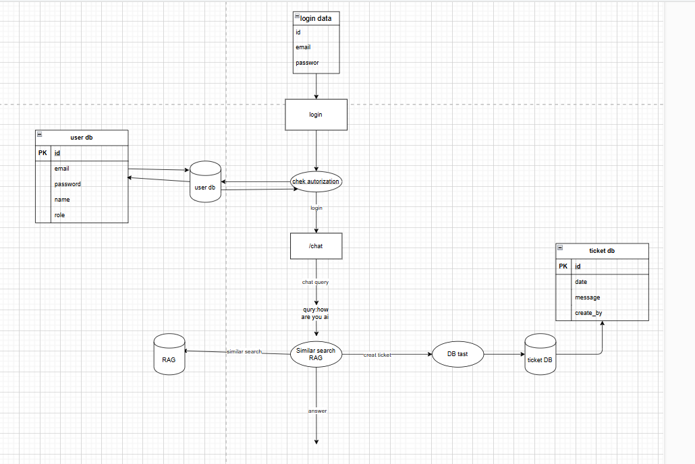
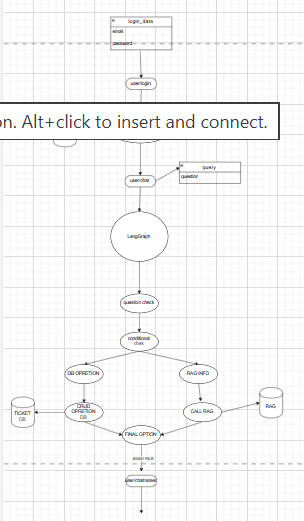
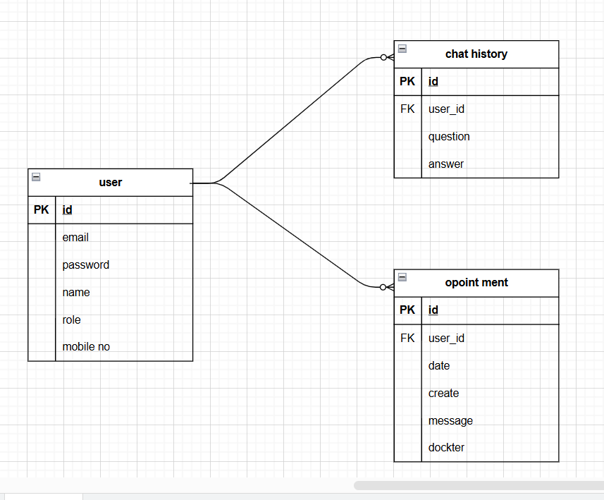

# Appointly — Backend

AI-powered hospital appointment booking system with a RAG-based chat assistant, role-based access control, and automated email notifications.

---

## ✨ Features

- 🔐 **Authentication & Authorization** — JWT-based login/register with role-based access (`user` / `admin`)
- 🤖 **AI Chat Assistant (RAG + LLM Agent)** — Users can chat and ask questions about hospital data (services, doctors, timings, private hospital info) using a Retrieval-Augmented Generation pipeline
- 🧠 **LangGraph-based Agent Flow** — Conditional routing between database operations and RAG-based information retrieval depending on the user's query
- 📅 **Appointment Management (CRUD)**
  - Users can create, read, and manage their own appointments through chat
  - Admin can view, read, and delete today's appointments
- 🗂️ **Admin Data Control** — Admin can upload new hospital data into the RAG knowledge base, and delete/update existing data
- 💬 **Chat History Storage** — All user chat interactions (question/answer pairs) are stored and linked to the user
- ⚡ **Redis Caching** — Used for session/data caching to speed up repeated queries and reduce DB load
- 📧 **Automated Email Notifications**
  - Confirmation email is sent when a user logs in / books an appointment
  - Reminder email is automatically sent on the appointment date
- 🔒 **Role-based Data Privacy** — Sensitive hospital data and appointment records are only accessible based on user role

---

## 🏗️ System Architecture

The system has two main users — **User** and **Admin**. On login, the request is authenticated, and based on the query type it's routed either to a database operation (appointments/tickets) or to the RAG pipeline for hospital-related information.



**Flow summary:**
1. User logs in → credentials verified against `user db`
2. On successful login, user is routed to `/chat`
3. Query is checked — if it needs hospital knowledge, it goes through **similarity search on RAG**
4. If the query is appointment/ticket related, a DB operation is performed and stored in `ticket db`
5. Final answer is returned to the user

---

## 🧩 Agent Decision Flow (LangGraph)

The chat agent uses LangGraph to decide whether a query needs a **database operation** (like booking/reading/deleting an appointment) or **RAG-based info retrieval** (hospital details, FAQs, etc.), before returning the final response.



---

## 🗃️ Entity Relationship Diagram (ERD)



**Tables:**

| Table | Fields |
|---|---|
| **user** | `id (PK)`, `email`, `password`, `name`, `role`, `mobile_no` |
| **chat_history** | `id (PK)`, `user_id (FK)`, `question`, `answer` |
| **appointment** | `id (PK)`, `user_id (FK)`, `date`, `create`, `message`, `docter` |

- One `user` → many `chat_history` records
- One `user` → many `appointment` records

---

## 👥 Roles & Permissions

| Action | User | Admin |
|---|:---:|:---:|
| Chat with AI assistant | ✅ | ✅ |
| Book / view own appointments | ✅ | ✅ |
| Ask about hospital info (RAG) | ✅ | ✅ |
| Upload new hospital data to RAG | ❌ | ✅ |
| Delete hospital data from RAG | ❌ | ✅ |
| View all appointments | ❌ | ✅ |
| Delete today's appointments | ❌ | ✅ |

---

## 🛠️ Tech Stack

- **Runtime:** FastApi
- **Database:** Postresql
- **Caching:** Redis , celery
- **AI/LLM:** LangGraph agent + RAG pipeline (vector similarity search) + Langchain
- **Auth:** JWT
- **Email:** email

---

## 📡 API Overview

> Update with your actual routes/controllers.

### Auth
| Method | Endpoint | Description |
|---|---|---|
| POST | `/auth/register` | Register a new user |
| POST | `/auth/login` | Login and receive JWT token |

### Chat
| Method | Endpoint | Description |
|---|---|---|
| POST | `/chat` | Send a query to the AI agent (routes to RAG or DB operation) |

### Appointments
| Method | Endpoint | Description |
|---|---|---|
| GET | `/appointment` | Get user's appointments |
| POST | `/appointment` | Create a new appointment |
| DELETE | `/appointment/:id` | Delete an appointment (admin) |

### Admin — RAG Data
| Method | Endpoint | Description |
|---|---|---|
| POST | `/admin/data` | Upload new hospital data to RAG |
| DELETE | `/admin/data/:id` | Delete data from RAG |

---

## ⚙️ Environment Variables

Create a `.env` file in the root:

```env
DATABASE_URL=postgresql://.........../postgres
SECRETE_KY=m..........
GROQ_API=gsk_JSFHvhXz0un............
SEARCH_KEY=e1531e80-6...........
SQL_GROQ_API=gsk_33EsTZ.........
TOKEN_EXP=30
PINECONE=pcsk_4tN5SW_Ej3F3KGdi7j..........
REDIS_HOST=sprout-......
REDIS_PORT=1.....
REDIS_DB=0
REDIS_USERNAME=.....
REDIS_PASSWORD=JiLp7yM......


---

## 🚀 Installation

```bash
git clone https://github.com/username/appointly-backend.git
cd appointly-backend
npm uv
npm  uv run uvicorn main:app --relaod
```

Server will start at `http://localhost:5000` (or your configured `PORT`).

---

## 🔗 Related Repositories

- Frontend: [appointly-frontend](https://github.com/username/appointly-frontend)

---

## 📁 Project Structure (partial)

```
appointly-backend/
├── images/
│   ├── digram__1_.png     # ER Diagram
│   ├── digram__2_.png     # System architecture flow
│   └── digram__3_.png     # LangGraph agent flow
├── src/
│   ├── controllers/
│   ├── models/
│   ├── routes/
│   └── config/
├── .env.example
└── README.md
```
